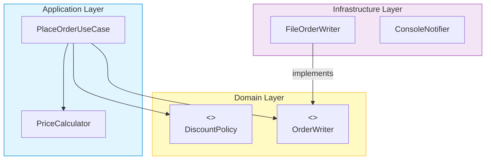

# 第25章：SOLID統合リファクタ（全部つなげる）🧶🌈✨

この章は「**今ある動くコード**」を、**SRP→OCP→LSP→ISP→DIP**の順で、ちゃんと“筋の通った形”に整える回だよ〜😊💖
ゴールはシンプル！

* ✅ 「変更に強い」形に直せるようになる
* ✅ “直してる途中で壊す”を防ぐために、テストで守りながら進められる
* ✅ AI（Copilot/Codex）に手伝わせつつ、**最後の判断は自分**でできるようになる🤖🫶


---

## 0) 本日時点の「道具の最新版」ざっくり🧰✨

この章のコード例は、次の“今どき前提”で書くね（バージョンは参考）👇

* TypeScript は **5.9 系**が最新ライン（5.9.3 が Latest 表示）だよ🟦 ([GitHub][1])
* `tsc --init` で生成される初期 `tsconfig` をベースに、**module: nodenext / target: esnext / strict: true** などに調整するのが今どきの基本だよ⚙️ ([typescriptlang.org][2])
* Node.js は **v24.12.0 が Latest LTS** 表示だよ🟩 ([nodejs.org][3])
* VS Code は **1.108（2025年12月版）**が 2026/01/08 リリースで、エージェント系の改善も入ってるよ🧠✨ ([Visual Studio Code][4])
* テストは **Vitest 4.0**（Browser Mode安定化など大きめアップデート）🧪 ([Vitest][5])
* ちなみに TypeScript 6.0/7.0 の話も進んでるけど、この章は「今のプロジェクトを強くする」が主役だよ🧱 ([Microsoft for Developers][6])

---

## 1) 今日の題材：Campus Café 注文アプリ ☕️📦

やることはこんな感じ👇

* 注文（items）を受け取る
* 割引（クーポン）を適用する
* 支払い（現金/カード/Pay系など）
* 保存（JSON/DB などに将来変更したい）
* 通知（メール/アプリ通知/ログなどに将来増える）

…この「将来増えそう」こそ、SOLIDの出番だよ〜！🥳✨

---

## 2) まずは “ニオイ” を用意しよう👃💥（Beforeコード）

最初は、わざとありがちな「全部入りサービス」からスタートするよ😇
（この“地獄”を整えるのが第25章！）

```ts
// src/before/OrderService.ts
type Item = { id: string; name: string; price: number; qty: number };

type OrderInput = {
  userId: string;
  items: Item[];
  couponCode?: "STUDENT10" | "RAINY5" | "NONE";
  payment: "cash" | "card";
  notify: "email" | "log";
};

export class OrderService {
  async placeOrder(input: OrderInput): Promise<{ total: number; orderId: string }> {
    // 1) 合計計算（税とか端数とか増えがち）
    let subtotal = 0;
    for (const it of input.items) subtotal += it.price * it.qty;

    // 2) 割引（if/switchが増殖しがち）
    let discount = 0;
    switch (input.couponCode ?? "NONE") {
      case "STUDENT10":
        discount = subtotal * 0.1;
        break;
      case "RAINY5":
        discount = 500;
        break;
      case "NONE":
      default:
        discount = 0;
        break;
    }

    const total = Math.max(0, Math.floor(subtotal - discount));

    // 3) 支払い（本当は外部APIとかに行くのに直書き）
    if (input.payment === "card") {
      // pretend: charge card
    } else {
      // pretend: cash
    }

    // 4) 保存（将来DBにしたいのに、直書き…）
    const orderId = "ORD-" + Math.random().toString(16).slice(2);
    const record = { orderId, userId: input.userId, items: input.items, total, createdAt: Date.now() };
    // pretend: write file
    JSON.stringify(record);

    // 5) 通知（増えた瞬間にさらにカオス）
    if (input.notify === "email") {
      // pretend: send email
    } else {
      console.log("ORDER:", record);
    }

    return { total, orderId };
  }
}
```

### このコードの問題、言語化できる？📝✨

* 変更理由が多すぎる（SRP違反）😵‍💫
* 割引が増えるたびに `switch` を修正（OCP違反）💣
* 支払い/保存/通知が直結（DIP違反）🧷
* テストしにくい（外部っぽい処理が混ざる）😢

---

## 3) 統合リファクタの鉄則（この章の「型」）🔁✅

リファクタは「気合」じゃなくて、**手順**だよ🧸✨

### 鉄則A：最初に “守りのテスト” を作る🛡️🧪

仕様が曖昧でもOK！
まずは「今の挙動」を固定する **キャラクタリゼーションテスト** を置くよ✨

```ts
// src/before/OrderService.spec.ts
import { describe, it, expect } from "vitest";
import { OrderService } from "./OrderService";

describe("OrderService (before)", () => {
  it("学生割引が適用される", async () => {
    const svc = new OrderService();
    const res = await svc.placeOrder({
      userId: "u1",
      items: [{ id: "c1", name: "coffee", price: 600, qty: 2 }], // 1200
      couponCode: "STUDENT10", // -120
      payment: "cash",
      notify: "log",
    });
    expect(res.total).toBe(1080);
  });

  it("雨の日割引(500円)が適用される", async () => {
    const svc = new OrderService();
    const res = await svc.placeOrder({
      userId: "u1",
      items: [{ id: "s1", name: "sand", price: 700, qty: 1 }], // 700
      couponCode: "RAINY5", // -500
      payment: "cash",
      notify: "log",
    });
    expect(res.total).toBe(200);
  });
});
```

これがあると、以後は **「テストが緑ならOK💚」** で進められるよ！

---

## 4) ステップ1：SRP（責務で割る）✂️🧩

### やること

「placeOrder」が抱えてる責務を **名前で分ける** だけでOK！

* 料金計算 → `PriceCalculator` 💰
* 割引 → `DiscountPolicy`（次でOCPに繋げる）🎟️
* 支払い → `PaymentGateway` 💳
* 保存 → `OrderRepository` 🗄️
* 通知 → `Notifier` 🔔

まずは “切り出すだけ” でいいよ😊✨（中身はまだ雑でもOK）

```ts
// src/app/PriceCalculator.ts
export type LineItem = { price: number; qty: number };

export class PriceCalculator {
  calcSubtotal(items: LineItem[]): number {
    return items.reduce((sum, it) => sum + it.price * it.qty, 0);
  }
  calcTotal(subtotal: number, discount: number): number {
    return Math.max(0, Math.floor(subtotal - discount));
  }
}
```

---

## 5) ステップ2：OCP（増えるところに“差し替え口”）🚪✨

割引が増えるのが見えてるなら、`switch` は卒業🎓💥
**戦略パターン（Strategy）**でいこ〜！

```ts
// src/domain/discount/DiscountPolicy.ts
export interface DiscountPolicy {
  readonly code: string;
  calcDiscount(subtotal: number): number;
}
```

```ts
// src/domain/discount/Student10Policy.ts
import type { DiscountPolicy } from "./DiscountPolicy";

export class Student10Policy implements DiscountPolicy {
  readonly code = "STUDENT10";
  calcDiscount(subtotal: number): number {
    return subtotal * 0.1;
  }
}
```

```ts
// src/domain/discount/Rainy5Policy.ts
import type { DiscountPolicy } from "./DiscountPolicy";

export class Rainy5Policy implements DiscountPolicy {
  readonly code = "RAINY5";
  calcDiscount(_: number): number {
    return 500;
  }
}
```

```ts
// src/domain/discount/DiscountPolicies.ts
import type { DiscountPolicy } from "./DiscountPolicy";

export class DiscountPolicies {
  constructor(private readonly policies: DiscountPolicy[]) {}

  getByCode(code?: string): DiscountPolicy | undefined {
    if (!code) return undefined;
    return this.policies.find(p => p.code === code);
  }
}
```

👉 これで割引を増やすときは **「クラス追加」だけ**になって気持ちいい〜！🥰🎉

---

## 6) ステップ3：LSP（差し替えても壊れない）🧩🔒

OCPで差し替えられるようになったら、次は **「差し替えても同じルールで動く」**を保証したい！

ここで便利なのが **契約テスト（Contract Test）**✨
「DiscountPolicyならこう振る舞うべき」をテストとして固定するよ🧪

```ts
// src/domain/discount/discountPolicy.contract.spec.ts
import { describe, it, expect } from "vitest";
import type { DiscountPolicy } from "./DiscountPolicy";
import { Student10Policy } from "./Student10Policy";
import { Rainy5Policy } from "./Rainy5Policy";

function contract(make: () => DiscountPolicy) {
  describe(make().constructor.name, () => {
    it("割引は0以上", () => {
      const p = make();
      expect(p.calcDiscount(1000)).toBeGreaterThanOrEqual(0);
    });

    it("subtotalが0なら割引も0以上（変なマイナスを作らない）", () => {
      const p = make();
      expect(p.calcDiscount(0)).toBeGreaterThanOrEqual(0);
    });
  });
}

describe("DiscountPolicy contract", () => {
  contract(() => new Student10Policy());
  contract(() => new Rainy5Policy());
});
```

こういう「最低限のルール」を増やすと、将来の実装追加が安心になるよ〜☺️🫶

---

## 7) ステップ4：ISP（巨大interfaceを分割）✂️📄

よくある事故👇
「Repositoryってさ、読み取りも書き込みも検索も全部…」ってやつ😇

分割のコツはこれ：

* 読むだけ → `OrderReader` 📚
* 書くだけ → `OrderWriter` ✍️

```ts
// src/domain/order/OrderRepository.ts
export type OrderRecord = {
  orderId: string;
  userId: string;
  total: number;
  createdAt: number;
};

export interface OrderWriter {
  save(record: OrderRecord): Promise<void>;
}

export interface OrderReader {
  findById(orderId: string): Promise<OrderRecord | undefined>;
}
```

「使う側」は必要な方だけ依存できるから、軽くなるよ🪶✨

---

## 8) ステップ5：DIP/DI（依存の向きを直して、注入する）💉🧠

ここが“統合回”のラスボス👑🔥

### 目標

* 重要ロジック（注文の流れ）が

  * ファイル保存の詳細
  * メール送信の詳細
  * 決済の詳細
    に振り回されないようにする！

つまり、アプリ側は **インターフェース（抽象）**だけ知ってればOKにするよ😊✨

```ts
// src/app/ports.ts
import type { OrderWriter } from "../domain/order/OrderRepository";

export interface PaymentGateway {
  pay(total: number): Promise<void>;
}

export interface Notifier {
  notify(message: string): Promise<void>;
}

export type Ports = {
  orderWriter: OrderWriter;
  paymentGateway: PaymentGateway;
  notifier: Notifier;
};
```

そしてユースケース（注文処理）は Ports を受け取るだけ👇

```ts
// src/app/PlaceOrderUseCase.ts
import { PriceCalculator } from "./PriceCalculator";
import { DiscountPolicies } from "../domain/discount/DiscountPolicies";
import type { Ports } from "./ports";

type Item = { id: string; name: string; price: number; qty: number };

type PlaceOrderInput = {
  userId: string;
  items: Item[];
  couponCode?: string;
};

export class PlaceOrderUseCase {
  constructor(
    private readonly ports: Ports,
    private readonly priceCalc: PriceCalculator,
    private readonly discounts: DiscountPolicies
  ) {}

  async execute(input: PlaceOrderInput): Promise<{ total: number; orderId: string }> {
    const subtotal = this.priceCalc.calcSubtotal(input.items);
    const policy = this.discounts.getByCode(input.couponCode);
    const discount = policy?.calcDiscount(subtotal) ?? 0;
    const total = this.priceCalc.calcTotal(subtotal, discount);

    await this.ports.paymentGateway.pay(total);

    const orderId = "ORD-" + Math.random().toString(16).slice(2);
    await this.ports.orderWriter.save({
      orderId,
      userId: input.userId,
      total,
      createdAt: Date.now(),
    });

    await this.ports.notifier.notify(`Order ${orderId} paid: ${total}`);
    return { total, orderId };
  }
}
```

最後に **Composition Root（組み立て係）**で、本物の実装を注入するよ🧩✨

```ts
// src/main.ts (Composition Root)
import { PlaceOrderUseCase } from "./app/PlaceOrderUseCase";
import { PriceCalculator } from "./app/PriceCalculator";
import { DiscountPolicies } from "./domain/discount/DiscountPolicies";
import { Student10Policy } from "./domain/discount/Student10Policy";
import { Rainy5Policy } from "./domain/discount/Rainy5Policy";

// infra（詳細側）
import { FileOrderWriter } from "./infra/FileOrderWriter";
import { FakePaymentGateway } from "./infra/FakePaymentGateway";
import { ConsoleNotifier } from "./infra/ConsoleNotifier";

const usecase = new PlaceOrderUseCase(
  {
    orderWriter: new FileOrderWriter("./data/orders.json"),
    paymentGateway: new FakePaymentGateway(),
    notifier: new ConsoleNotifier(),
  },
  new PriceCalculator(),
  new DiscountPolicies([new Student10Policy(), new Rainy5Policy()])
);

// 例：実行
await usecase.execute({
  userId: "u1",
  items: [{ id: "c1", name: "coffee", price: 600, qty: 2 }],
  couponCode: "STUDENT10",
});
```

これでアプリの中心（UseCase）は「詳細を知らない」状態になるよ🥹💖
差し替え超かんたん！🎭✨



---

## 9) 統合Afterで「強くなったポイント」まとめ🌈✅

### ✅ 追加が楽になった（OCP）

* 割引追加：Policyクラスを1個増やすだけ🎟️
* 通知追加：Notifier実装を1個増やすだけ🔔
* 保存先変更：OrderWriter実装を差し替えるだけ🗄️

### ✅ テストが書きやすい（DIP/DI）

UseCaseに **偽物（Fake）**を注入できるから、外部なしでテストできるよ🧪✨

```ts
// src/app/PlaceOrderUseCase.spec.ts
import { describe, it, expect } from "vitest";
import { PlaceOrderUseCase } from "./PlaceOrderUseCase";
import { PriceCalculator } from "./PriceCalculator";
import { DiscountPolicies } from "../domain/discount/DiscountPolicies";
import { Student10Policy } from "../domain/discount/Student10Policy";

describe("PlaceOrderUseCase", () => {
  it("学生割引で合計が減る", async () => {
    const saved: any[] = [];
    const notified: string[] = [];

    const usecase = new PlaceOrderUseCase(
      {
        paymentGateway: { pay: async () => {} },
        orderWriter: { save: async (r) => saved.push(r) },
        notifier: { notify: async (m) => notified.push(m) },
      },
      new PriceCalculator(),
      new DiscountPolicies([new Student10Policy()])
    );

    const res = await usecase.execute({
      userId: "u1",
      items: [{ id: "c1", name: "coffee", price: 600, qty: 2 }], // 1200
      couponCode: "STUDENT10",
    });

    expect(res.total).toBe(1080);
    expect(saved).toHaveLength(1);
    expect(notified[0]).toContain("paid");
  });
});
```

---

## 10) AI（Copilot/Codex）を “安全に” 使うコツ🤖🫶

AIは最強の相棒だけど、リファクタでは「暴走」もしがち！😵‍💫
だからこの章は、**AIの使い方そのもの**も練習しよ〜✨

### 使えるプロンプト例（コピペOK）📎💬

* 🧭 **計画を出させる**

  * 「このクラスをSRPで分割したい。責務候補と新しいクラス案、移行手順を“テストを壊さない順番”で提案して」
* 🧪 **守りのテスト**

  * 「この関数の現状挙動を固定するcharacterization testをVitestで作って」
* 🔍 **危険箇所の指摘**

  * 「このリファクタ案で壊れやすい点、依存関係が悪化する点をレビューして」
* 🧾 **差分レビュー**

  * 「このdiffで“責務が混ざってるところ”と“interfaceが肥大化しそうなところ”を指摘して」

VS Code 1.108 のリリースノートでも、エージェント周りが強化されてて、手順書やドメイン知識を読み込ませる方向が進んでるよ🧠✨ ([Visual Studio Code][4])

---

## 11) ミニ課題（この章のチェックポイント）🎯🎁

### 課題A：割引を1つ増やしてみよ🎟️✨

* 例：`SET1000`（1000円以上で100円引き）
* ✅ 既存コードの修正が最小になってる？（理想：追加だけ）

### 課題B：通知を増やしてみよ🔔📱

* `SlackNotifier`（ダミーでOK）を追加
* ✅ UseCase は変更せず、Composition Rootだけ変えて差し替えできる？

### 課題C：契約テストを1本追加🧩🧪

* 「割引は subtotal を超えない」とか
* ✅ 新しいPolicyを追加しても自動で守られる？

---

## 12) まとめ：第25章で身につく“最重要スキル”🌟

この章で一番大事なのはこれ👇

**「動いてるものを、壊さずに、筋の良い形へ持っていく手順」**🧶✨

* 🛡️ テストで守る
* ✂️ SRPで切る
* 🚪 OCPで差し替え口を作る
* 🧩 LSPで差し替えの安全性を上げる
* 📄 ISPで薄く保つ
* 💉 DIP/DIで依存の向きを正す

ここまでできたら、卒業制作（26〜28章）がめちゃ楽になるよ〜！🎓🎉

---

次は、この第25章の内容をそのまま使って、**「Campus Café 注文アプリ」を“卒業制作の土台”として設計していく**流れに入れるよ☕️🏗️✨

[1]: https://github.com/microsoft/typescript/releases "Releases · microsoft/TypeScript · GitHub"
[2]: https://www.typescriptlang.org/docs/handbook/release-notes/typescript-5-9.html "TypeScript: Documentation - TypeScript 5.9"
[3]: https://nodejs.org/en "Node.js — Run JavaScript Everywhere"
[4]: https://code.visualstudio.com/updates "December 2025 (version 1.108)"
[5]: https://vitest.dev/blog/vitest-4?utm_source=chatgpt.com "Vitest 4.0 is out!"
[6]: https://devblogs.microsoft.com/typescript/progress-on-typescript-7-december-2025/?utm_source=chatgpt.com "Progress on TypeScript 7 - December 2025"
